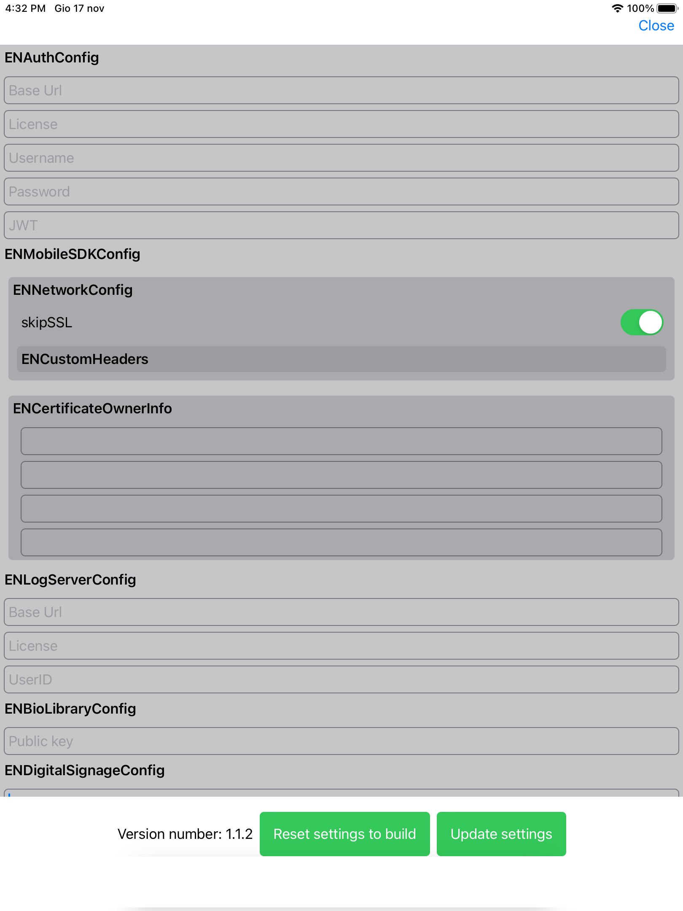

## ENMobileSDK (conventionally ENCore)


It's the core module. This module is included in every submodule, and keeps common functions to avoid circular dependencies between them. So it's not necessary to add to every module.

1.  [Installation](#COCOAPODS)
2.  [Basic usage](#basic-usage)
3.  [Logs](#logs)
4.  [ENLanguage](#enlanguage)
5.  [ENCertificateSourceType](#encertificatesourcetype)
6.  [ENAuthenticable](#enauthenticables)
7.  [Theme](#theme)
8.  [Utilities](#utilities)
9.  [Advanced usage](#advanced-usage)
    - [ENBioLibraryConfig](#enbiolibraryconfig)
    - [ENNetworkConfig](#ENNetworkConfig)
    - [KeepScreenAlwaysOn](#KeepScreenAlwaysOn)
    - [ENMobileSDKEvent](#enmobilesdkevent)
    - [Settings](#settings)

## COCOAPODS

Add `pod 'ENMobileSDK', '1.3.9'` to your **PodFile**

## Basic usage

This SDK is builder-oriented, so every step is linked to previous and next, without possibility to shuffle them. You can find optional fields, but when something is required, is necessary to go on.

Below a basic setup (without any module). As you'll see, there's a function which requires an `ENAuthenticable` entity. These entities are the modules required in your application. Any of them has it's own builder with them configs and setups. Here you can see the `async/await` for the builder, but you can also call the _old one_ with completion at the end.

```swift
Task {
    let mobileSDK = await ENMobileSDK
        .with(
            enAuthConfig: ENAuthConfig(
                baseUrl: baseUrl,
                license: licenseKey,
                username: username,
                password: password
                ),
            enMobileSDKConfig: ENMobileSDKConfig(
                enabledLanguages: [.en], keepScreenAlwaysOn: false, considerAllSignatureFieldCharacters: true, appVersion: "app_version_string"))
		.with(enTheme: nil)
        .with(certificateOwnerInfo: ENCertificateOwnerInfo())
        .with(
            logLevel: .verbose,
            logServerSource: .customExecMap(ENLogServerConfig(
                baseURL: "baseurl",
                licenseCode: "licenseCode",
                userID: "userID")))
        .with { initCallback in
            switch initCallback {
                case .error(let error):
                    ENMobileSDK.shared?.manageError(error, completion: {
                        ...
                    })
                default:
                    break
                }
			// here you can do whatever you need with errors or initCallback
		}
        .with(responseCallback: { responseCallback in
			// here you can do whatever you need with responseCallback
        })
        .with(authenticable: ...)
        .with(authenticableToEndBuilder: ...)
        .build()
}
```

### Logs

As you can see, there's a log section config, where you can set `logLevel`, `logServerSource` (which can be set as `.none` or `.customExecMap`, and in second case you pass `LogServerConfig` data, in which you set baseURL where send most important logs to server.

##### Logs accessibility

Logs are saved in `documents` folder, and if you add `Application supports iTunes file sharing` => `TRUE` to your plist file, you can access to your logs directly to Finder's device window if connected to your Mac. If your PC is Windows, you see them into iTunes App.

This builder returns an instance of `ENMobileSDK`, however you can also access to it's instance through `shared` instance.


### ENLanguage

The sdk implements a multi-language system. It saves the last choice, and keeps it in memory until next install.

```swift
public enum ENLanguage: String {
 case it = "it"
 case en = "en"
 case el = "el"
 case jor = "jor"
}
```

The requested languages are configurable in `ENMobileSDKConfig`. It requires an array of ENLanguages, and if there's not an already saved choice, it chooses the **first language in the array**.

### ENCertificateSourceType

Just after the language, you can set the `certificateSourceType`. By default, it's set to `.autogenerated`, which means that, through openSSL library, a self signed certificate is created (so a certificate not trusted by a Certification Authority).

```swift
public enum ENCertificateSourceType {
    case autoGenerated
    case p12(base64: String, password: String)
}
```

Alternatively you can choose to pass as parameter a `.p12` base64 string, which is the certificate with its private key, along with its password.

These certificates are used to apply a digital signature to each placed signature, ensuring the document's integrity cannot be altered.

### ENAuthenticables

```swift
public protocol ENAuthenticable {
 var productCode: String { get }
 var productSubcode: String { get }
 var isLicenseValid: Bool { get }
 static var name: ENMobileSDKModule { get }
 static var nameString: String { get }
}
```

It's a protocol which every module has to extend to be authenticated via [ENAuth](../ENAuth/README.md).

Once authenticated, every module is accessible through an utility variable defined on `ENMobileSDK instance`. For example, module `ENViewer` has a variable defined on ENMobileSDK, so that it's instance is accessible with: `ENMobileSDK.shared?.viewer`.

You'll se 2 different builder declarations for Authenticable:

```swift
 func with(authenticable: ENAuthenticable) -> ENMobileSDKAuthenticableBuilder

 func with(authenticableToEndBuilder authenticable: ENAuthenticable) -> ENMobileSDKEndBuilder
```

The first one is used for the first authenticables you build, the last one is necessary for the last one, so that you can go on building your `ENMobileSDK`.

**Example**

The SDK has an API to manage the dossier:

`findDossier` -> Retrieve dossier metadata given its GUID.

```swift
ENMobileSDK.shared?.softServer?.findDossier(dossierGuid: "GUID")
``` 

`findDocumentsInDossier` -> Retrieve all the documents in a dossier given the dossier's GUID.

```swift
ENMobileSDK.shared?.softServer?.findDocumentsInDossier(dossierGuid:  "GUID")
``` 

> Please note that all the functions for the dossier's API could throw an exception that has to be managed.

### SignatureMode

`defaultSignatureMode` available in `ENMobileSDKConfig`, is used to set up the default mode that the SDK use to sign a signature field. By default this is a **graphometric** signature for the entire document, but a signature by **OTP** can be set for the document.

```swift
public enum SignatureMode: Equatable, Hashable {
    case graphometric
    case otpByDocumentGuid(numberOfDigits: Int = 4, defaultHiddenDigits: Bool = true)

	...
}
```

> Note that when a signature by OTP is set:
> * as of now the final signature will be a **FES** signature
> * the OTP signature is based on the GUID of the document, so there has to be a properly configured SoftServer instance with all the logic, based on the document's GUID, to send the otp to the right recipient.
> * the OTP signature is not supported for local signatures

## Theme

To give an universal style to every module, we defined the `ENTheme` protocol. It contains variable which every module uses to define color, font or sizes for their graphic components.

If you want to create your own theme, just create a struct/class which extends this protocol:

```swift
public protocol ENTheme {
	var signatureBoxTheme: ENSignatureBoxTheme { get }
	var alertTheme: ENAlertTheme { get }
	var digitalSignageTheme: ENDigitalSignageTheme { get }
	var viewerTheme: ENViewerTheme { get }
}
```

Every variable is another protocol, which requires variables necessary to render our views from your theme.

#### SignatureBox theme

```swift
public protocol ENSignatureBoxTheme {
	var signatureBox: BackgroundStyle { get }
	var userContainer: BackgroundStyle { get }
	var confirmIcon: BackgroundStyle { get }
	var cancelIcon: BackgroundStyle { get }
	var repeatIcon: BackgroundStyle { get }
	var buttonTextStyle: TextStyle { get }
	var userTextStyle: TextStyle { get }
	var timestampTextStyle: TextStyle { get }
	var topContainer: BackgroundStyle { get }
	var bottomContainer: BackgroundStyle { get }
	var cancelTint: TintStyle { get }
	var userTint: TintStyle { get }
	var confirmTint: TintStyle { get }
	var repeatTint: TintStyle { get }
	var font: ENFont { get }
}
```

#### AlertTheme theme

```swift
public protocol ENAlertTheme {
	var confirmButton: LabelStyle { get }
	var cancelButton: LabelStyle { get }
	var normalButton: LabelStyle { get }
	var mainContainer: BackgroundStyle { get }
	var normalRightContainer: BackgroundStyle { get }
	var errorRightContainer: BackgroundStyle { get }
	var warningRightContainer: BackgroundStyle { get }


	var title: LabelStyle { get }
	var message: LabelStyle { get }
	var font: ENFont { get }
	var textField: BackgroundStyle { get }

	//MARK: - Progress style
	var progressTitle: LabelStyle { get }
	var progressSubtitle: LabelStyle { get }
	var progressContainer: BackgroundStyle { get }
	var progressBack: BackgroundStyle { get }
	var progress: BackgroundStyle { get }
}
```

#### DigitalSignage theme

```swift
public protocol ENDigitalSignageTheme {
	var selectedLanguage: BackgroundStyle { get }
	var otherLanguages: BackgroundStyle { get }
	var showGuid: TextStyle { get }
	var tabletId: TextStyle { get }
	var tabletIdBackground: BackgroundStyle { get }
	var showGuidBackground: BackgroundStyle { get }
}
```

#### Viewer theme

```swift
public protocol ENViewerTheme {
	var leftBar: ENBackgroundStyle { get }
    var rightBar: ENBackgroundStyle { get }
    var title: ENTextStyle { get }
    var subtitle: ENTextStyle { get }
    var enabledIcon: TintStyle { get }
    var fillEnabledIcon: TintStyle { get }
    var disabledIcon: TintStyle { get }
    var disabledContainer: ENBackgroundStyle { get }
    var confirm: ENBackgroundStyle { get }
    var abort: ENBackgroundStyle { get }
    var placeholder: ENLabelStyle { get }
    var confirmContainer: ENBackgroundStyle { get }
    var abortContainer: ENBackgroundStyle { get }
    var pinPadStyle: ENPinPadInputViewStyle { get }
    var pinPadButtonBackgroundColor: TintStyle { get }
    var pinPadButtonLabelColor: TintStyle { get }
    var pinPadButtonBorderColor: TintStyle { get }
    var pinPadActionButtonLabelColor: TintStyle { get }
    var pinPadActionButtonBackgroundColor: TintStyle { get }
    var otpLabelColor: TintStyle { get }
    var pinPadButtonSpacing: Int? { get }
}
```

The whole theme system works by these structs:

##### BackgroundStyle

```swift
public struct BackgroundStyle {
	var background: ENColor
	var cornerRadius: CGFloat
	var borderStyle: BorderStyle
}

```

##### TextStyle

```swift
public struct TextStyle {
	public enum FontWeight {
		case regular
		case light
		case medium
		case bold
	}

	var fontWeight: FontWeight
	var size: ENSize
	var text: ENColor
	var fontDefinition: ENFont
}
```

##### LabelStyle

```swift
public struct LabelStyle {
	var textStyle: TextStyle
	var backgroundStyle: BackgroundStyle
}
```

##### TintStyle

```swift
public struct TintStyle {
	var tint: ENColor
}
```

##### BorderStyle

```swift
public struct BorderStyle {
	var borderWidth: ENSize
	var border: ENColor
}
```

For convenience, I've defined `BasicColor`, `BasicSize` and `BasicFont` with their constructor necessary to extends `ENColor`, `ENSize` and `ENFont`. However you can create your own structs or just extend these protocols on your class to define your theme.

## Utilities

### Alerts

The main public function is

```swift
@discardableResult
public func showAlert(
	alertType: ENAlertViewController.AlertType,
	title: String,
	subtitle: String,
	firstButton: AlertButton? = nil,
	secondButton: AlertButton? = nil,
	alertTextFieldAction: AlertTextField? = nil,
	inViewController viewController: UIViewController? = nil)
```

To make its use much easier, you can find also some _packed_ functions which returns a specific type of alert:

- Input alert:

```swift
 public func showInputAlert(
 	title: String,
	subtitle: String,
	alertTextFieldAction: AlertTextField,
	inViewController viewController: UIViewController? = nil)
```

- Progress alert:

```swift
public func showProgress(
	withTitle title: String,
	subtitle: String,
	inViewController viewController: UIViewController? = nil)
```

- Document list alert:

```swift
@discardableResult public func showListAlert(
	_ alertList: AlertList) -> ENAlertViewController?
```

The `AlertList` param is a struct which contains an array of `ENDocum` and a callback which returns the selected `ENDocum`.

```swift
public struct ENDocum {
	public init(name: String, url: String) {
		self.name = name
		self.url = url
	}
	public var name: String
	public var url: String
}
```

This alert is mostly used to choose a document to interact with from local source (for example from the `Bundle`). In example directory there's one which shows how to use it.

## Advanced usage

### ENBioLibraryConfig
In this configuration file, the certificate for encrypting biometric data can be set (please see the examples). The certificate must be in a `pem` format.
> NOTE: the `pem` certificate is only used to encrypt the biometric data, not to sign the document with an integrity signature


### ENNetworkConfig

This config is available as a parameter of `ENMobileSDKConfig`, and requires these informations:

```swift
public struct ENNetworkConfig {
    var skipSSL: Bool
    public var oAuth2: ENOAuth2?
    var customHeaders: [String: ENCustomHeader]
    var customBody: ENCustomBody
}
```

#### ENOAuth2

ENMobileSDK let you setup an OAuth2 proxy to authenticate and authorize our APIs respecting your authentication rules. It gives an url to make authentication and a struct or a class which respect `OAuth2Parameters` protocol:

```swift
public protocol OAuth2Parameters {
    var headersDict:    [String: Any] { get }
    var bodyDict:       [String: Any] { get }
    var deviceSerialNumber: String?   { get }
}
```

These let's you make a request with headers or body required from your OAuth2 url, and then get back an OAuth2 token to pass to our requests.

#### Custom headers

This key-value structure lets you add additional headers to add to every request

#### Custom body

This structure has a key and a key-value body as variables. The `key` is the only one difference between custom headers. In fact lets you _inject_ a json with custom datas inside our requests.

### KeepScreenAlwaysOn

This flag, available in `ENMobileSDKConfig`, lets you prevent sleep mode of your tablet.

### ENMobileSDKEvent

ENMobileSDK communication between modules is made by a custom pub-sub event management. There are many event implemented, used internally by the modules, or even available to be used by the host app.

```swift
public enum ENMobileSDKEvent: String {
    case willEnterForeground
    case didEnterBackground
    case canConfirmDocument
    case disableConfirmDocument
    case didSignDocument(documentGuid: String? = nil, signatureName: String? = nil, signatureImage: UIImage? = nil)
    case signDocument(guid: String? = nil, watermarkHeight: CGFloat? = nil, watermarkOrderedValues: [String]? = nil, forceSignatureType: DocumentSignatureType? = nil)
    case signLocalDocument(document: ENDocum? = nil, watermarkHeight: CGFloat? = nil, watermarkOrderedValues: [String]? = nil, forceSignatureType: DocumentSignatureType? = nil)
    case abortedDocument
    case closedDocument(guid: String? = nil)
    case cancelledDocument
    case viewerDidClose(container: PDFContainer? = nil)
    case viewLocalDocument
    case viewDocument
    case viewerIsIdle
    case reachabilityChanged
    case sdkInitialized
}
```

Some event have custom data parameters and an of such custom data are:
* a custom height for the watermark information inside the signature image
* a custom list of strings for the watermark information inside the signature image
* the type of the signature (FES/FEA)


As I said before, these are implemented for internal use, but you can subscribe to them and get events too.

To subscribe to an event, just call this function:

```swift
let yourReturnedCallBack = ENMobileSDK.subscribe(toSocketEvent: .closedDocument) { closedDocumentData in

}
```


This function returns an `ENMobileSDKCallback`, so that you can unsubscribe to this event whenever you want, by calling:

```swift
ENMobileSDK.unsubscribe(callback: yourReturnedCallback)
```

#### Examples
###### didSignDocument(documentGuid: String? = nil, signatureName: String? = nil, signatureImage: UIImage? = nil)

The didSignDocument event is triggered whenever a signature is successfully applied to a document. The event carries the GUID of the document and the image (UIImage) of the newly applied signature with the signature name.

```swift
let callback = ENMobileSDK.subscribe(toSocketEvent: .didSignDocument()) { didSign in
    if case .didSignDocument(let documentGuid, let signatureName, let signatureImage) = didSign {
		// Handle the event here
    }
}

```


### Settings

The `settings` class is used to change runtime and save in persistance area all network parameters in enmobilesdk and each submodules config.

You can call it by using:

```swift
SettingsManager.shared.present(inViewController: UIViewController, dismissCompletion: @escaping (Bool) -> Void)
```

When called appears the viewController as shown below.


